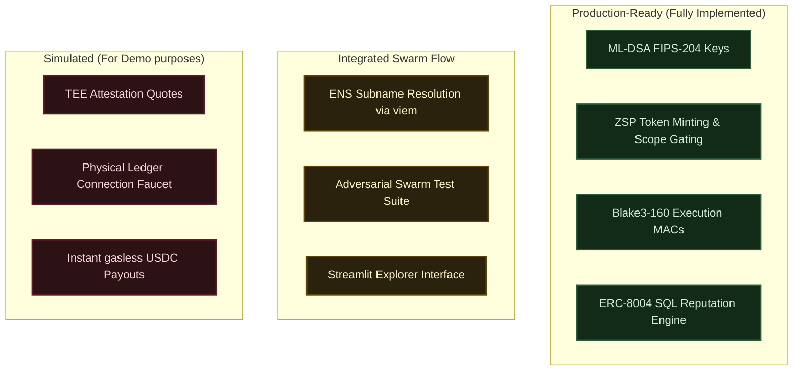

# Handoff × Impute: Demo & Video Outline (Goal F)

This document outlines the demo flow, slide deck structure, and honest-scope definitions for the final 3-minute video presentation.

---

## 1. End-to-End Demo Script

### Scenario Walkthrough: "Verifiable Agent Delegation & Settlement"
*Objective: Demonstrate the lifecycle of an autonomous AI agent performing a task under the Impute cryptographic identity stack, culminating in instant payment and public reputation tracking.*

| Step | Component | Visual / Action | Narration / Concept |
| :--- | :--- | :--- | :--- |
| **1. Ledger** | Human Consent (Tier-0) | User clear-signs a `spawn_agent` payload on the Ledger Dashboard. | *"Accountability starts with human consent. A human owner clear-signs an agent spawn request using their hardware wallet key, establishing the root of the delegation chain."* |
| **2. Spawn** | Agent Spin-up (Tier-1) | Broker verifies signature and spins up the agent enclave. Agent generates its own ML-DSA-65 keypair. | *"The broker verifies the signature and spawns the agent. The agent generates a post-quantum ML-DSA keypair inside its secure enclave."* |
| **3. ENS ID** | Identity Discovery | CLI/Frontend shows the agent's ENS subname resolving to its ML-DSA fingerprint and TEE attestation quote. | *"The agent registers its identity on ENS. Its subname resolves directly to the ML-DSA fingerprint and TEE quote, enabling any client to verify it runs in genuine hardware."* |
| **4. ZSP Task** | Scoped Capability (Tier-2) | Agent claims a task; Orchestrator mints a Zero-Standing-Privilege token containing a 5-minute TTL, target audience, and specific allowed actions (`update_task`, `submit_result`). | *"When the agent claims a task, it receives a Zero-Standing-Privilege token. Instead of root keys, the agent is granted capability-scoped access with a short lifetime."* |
| **5. Arc Settle** | Execution MAC (Tier-3) & Nanopayment | Agent submits work signed with Blake3-160 execution MAC. Broker verifies the MAC against the ZSP key, registers task PASS, and settles a gasless USDC payment (EIP-3009) to the agent's wallet. | *"Upon task verification, the broker validates the Blake3 micro-action MAC and triggers an instant on-chain USDC payout from escrow directly to the agent's address."* |
| **6. Reputation**| Reputation Engine & Dashboard | Streamlit explorer displays the agent's work history and ERC-8004 query results. | *"Every verified completion updates the agent's public reputation. Anyone can query the ERC-8004 reputation engine to audit work history before hiring."* |

---

## 2. Deck Outline (3-Minute Presentation)

### Slide 1: Title Slide
*   **Visual**: Sleek dark-mode graphic showing an interconnected AI swarm with cryptographic links.
*   **Headline**: Handoff: Accountable AI Swarms via the Impute Protocol.
*   **Subhead**: Verifiable cryptographic identities, scoped capabilities, and instant reputation tracking for autonomous agents.

### Slide 2: The Problem
*   **Visual**: Diagram showing a compromised agent with root API keys draining funds or executing unauthorized actions.
*   **Points**:
    *   **Standing Privilege**: Agents hold persistent, unchecked credentials.
    *   **Attribution Collapse**: Swarm operations lack verifiable proof of who did what.
    *   **Trust Deficit**: No hardware-rooted proof of execution environments.

### Slide 3: The Solution: Impute Identity Stack
*   **Visual**: A vertical stack illustrating the four tiers:
    *   **Tier 0 (Human)**: Ledger clear-sign consent.
    *   **Tier 1 (Agent)**: ML-DSA keys + TEE attestation quotes.
    *   **Tier 2 (Capability)**: Zero-Standing-Privilege (ZSP) scoped tokens.
    *   **Tier 3 (Execution)**: Blake3-160 micro-action execution MACs.

### Slide 4: Live Demo Flow & Architecture
*   **Visual**: Flowchart mapping: Ledger Approval $\rightarrow$ Agent Enclave Spawn $\rightarrow$ ENS Registration $\rightarrow$ ZSP Token Gating $\rightarrow$ USDC Nanopayment $\rightarrow$ ERC-8004 Index.

### Slide 5: Impact & Swarm Safety
*   **Visual**: Comparison chart between traditional API-key agent networks and Impute-secured swarms.
*   **Key Metrics**:
    *   Zero credentials stored on-disk.
    *   Cryptographic non-repudiation for every micro-action.
    *   Real-time reputation queryable on-chain.

---

## 3. Honest-Scope Slide

*An honest summary of what is production-ready, what is integrated, and what is simulated/planned for the final submission.*

### Scope Breakdown
1.  **Fully Implemented**:
    *   **ML-DSA-65**: Key generation, signing, and ACVP Kat verification.
    *   **ZSP Gating**: Scoped authorization (audience, TTL, action bounds) and dynamic capability managers.
    *   **Blake3-160 MAC**: Key derivation and tag verification for micro-actions.
    *   **ERC-8004**: SQL query generation and reputation schemas.
2.  **Integrated**:
    *   **ENS Registry**: Subname metadata structure and resolver stubs.
    *   **Adversarial Sweeps**: 6-test suite verifying boundary security conditions (replays, context mix-ups).
3.  **Simulated / Mocks**:
    *   **TEE Attestation**: Quotes utilize simulated enclave measurements (`xtee-mock-v1`) rather than hardware TPM chips.
    *   **Ledger Hardware**: Faucet and broker interface mock user signatures.
    *   **nanopayments**: Base Sepolia ledger transactions are mocked on the local broker database.
